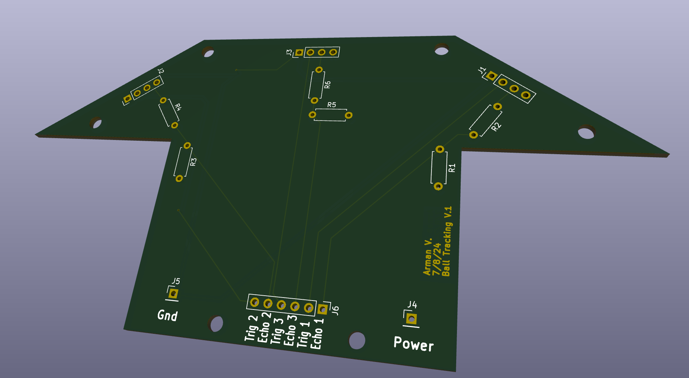
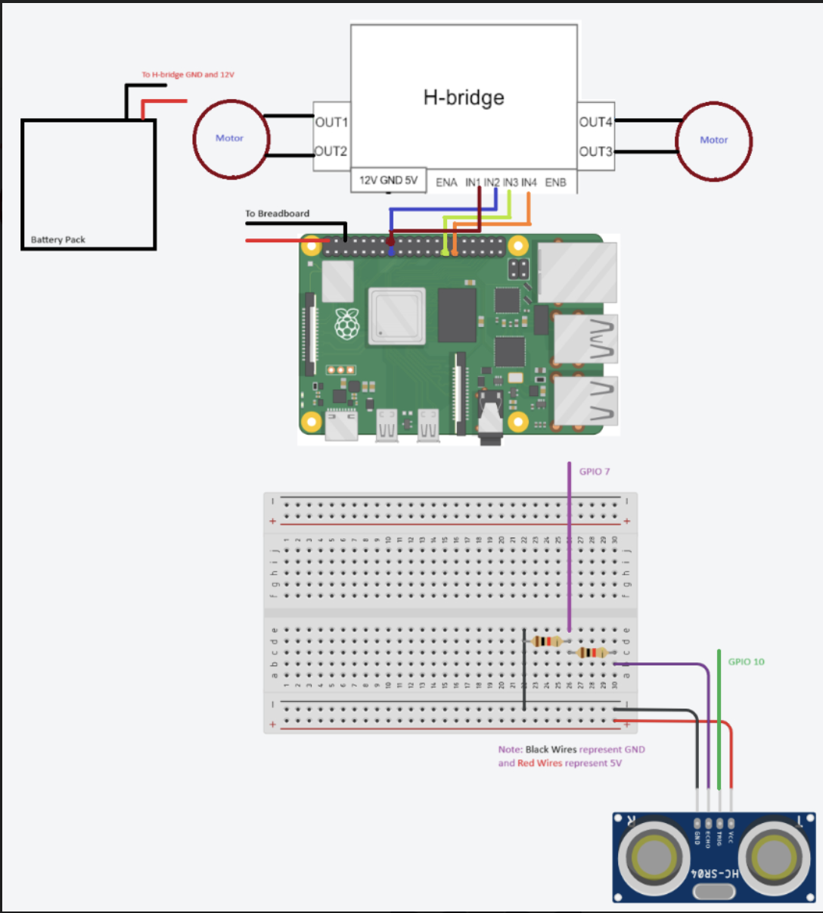

# Ball Tracking Robot
This project is a ball tracking robot which uses OpenCV, a python library for computer vision to track and follow a red ball. This project uses many components including a Raspberry Pi, a PiCamera, 2 DC motors, a motor driver, a power bank, a simple chassis, and ultrasonic sensors. The robot will track the red ball using its PiCamera and find the most optimal path towards it. 

| **Engineer** | **School** | **Area of Interest** | **Grade** |
|:--:|:--:|:--:|:--:|
| Arman V | Lynbrook High School | Mechanical Engineering | Incoming Sophmore


# Modification

<iframe width="560" height="315" src="https://www.youtube.com/embed/99KV1ccMx6s?si=g1k0cdHY3nWoqi-c" title="YouTube video player" frameborder="0" allow="accelerometer; autoplay; clipboard-write; encrypted-media; gyroscope; picture-in-picture; web-share" referrerpolicy="strict-origin-when-cross-origin" allowfullscreen></iframe>
### Summary
To enhance the performance of my robot I have added three main modifications. Two hardware and one software modification to help my robot trakc and follow the ball more effectively and efficiently.


### Modification 1 - PCB
As I was working on my robot, I realized that the circuit and wiring for the ultrasonic sensors were extremely messy and always getting stuck on the wheels, so I decided to design a PCB. A PCB or a printed circuit board is an electronic assembly which creates electrical connections between components using copper to replace a breadboard and a mess of wires. I used the software kicad to first design the schematic for my circuit and then transfer that over into a 3D model of the PCB with all the proper through holes connected. The biggest challenge with this modification was learning how to use all the new tools and capabilities to be able to build the schematic and PCB. The second part of the designing that I had trouble with was placing all the compenents in places where they can make their proper connections and still be in an accessible place to soulder the components in when I mount the PCB. This took a while as I tried many different designs until I finally decided on one. This modification was really helpful as it taught how to design a PCB, and in my future in STEM this skill will be really helpful to enhance and optimize and future projects.

 
 
### Modification 2 - Distance with Picamera

As per a suggestion from my instructor and as looking closer and testing the distance measurement with the ultrasonic sensors, I realized they are extremely finicky and often be up to 20 cm off the correct distance. With this information I decided that ultrasonic sensors will not be sufficient and accurate enough for its suggested use.To fix this, and after doing some research I decided to use the picamera to measure distance to the red ball. This use of the camera to measure is distance is something which a lot of modern day autonomous cars do. The most common way to tackle measuring distance with a camera is to use similar triangles. Inside a camera there are two important parts which the traingles are drawn between. First is the focal point or the point on the camera lense where the light converges. The other is the image sensor in the camera which the frame that the camera lens takes is projected on. One triangle is drawn between the object on the image sensor and the focal point while the second triangle is drawn between the focal point and the object in real life. Because as the object being tracked moves in real life also moves on the image sensor the triangles are similar and you can use ratios between the sides to derive the distane to the object in real life. My main challenge in this modification was learning and understanding the actual formula and how it works so that I could integrate it with my code. Learning this formula and understanding how distance measurment can be extremely useful for any upcoming projects that I do. 

### Modification 3 - Mecanum Wheel Movement

My Final and biggest Modification is the adding of mecanum wheels. These are wheels with smaller wheels coating the outside that allow for strafing or moving side to side and diagonally. This movement can be achieved If you placed the wheels in an x shape, while moving the diagonal motors in the same direction and the adjacent wheels in the opposite direction. I implemented this movement so that the tracking and following of the ball is more effecient and accurate then before. My biggest challenges with this modification were problems with the circuit. The motor drivers were pulling too much current from the microprocesser, the raspberry pi, and it crashing. To solve this I had to build a more effecient circuit by connecting the motor drivers directly instead of going through the pi. This modification was super helpful too me because learning how to use mecanum wheels properly can help with my robotics team  and the performance of any robots I chose to build in the future. 

  
# Final Milestone

<iframe width="560" height="315" src="https://www.youtube.com/embed/M_9ss_l-Xow?si=vxcebCMEeTglg11X" title="YouTube video player" frameborder="0" allow="accelerometer; autoplay; clipboard-write; encrypted-media; gyroscope; picture-in-picture; web-share" referrerpolicy="strict-origin-when-cross-origin" allowfullscreen></iframe>

### Summary
In the final milestone of my Ball Tracking Robot, I combined the software and hardware aspects of the project. Before this milestone I had a moving robot with keyboard inputs, Ultrasonic sensors that could measure distance between it and an object, and finally I had coded 
a picamera that could track the red ball. I had to integrate these 3 pieces of code so that the robot follows and tracks the red ball. There are two parts to the tracking part. One is the use of the picamera and its tracking of the red ball. I hold the coordinates of the center of the red ball and depending of the position of the center of the ball in the camera,  the robot will turn left, right, or move forward. To back up this data, I also use the ultrasonic sensors. If the distance from the right ultrasonic sensor to the ball is less than the distance to the left ultrasonic sensor then the robot will move left, and vice versa, yet if the ball is closest to the center ultrasonic sensor, or eqaul distance to the left and right sensors then the robot will drive straight. Finally I do obstalce detection. If the ball is not in the frame of the camera, but their is an obstacle in front of the robot, it uses the ultrasonic sensors like above to turn away or back up from the object. 

### Challenges

This final milestone was the hardest so far as it required integrating two pieces of working code, something which turned out to be much harder than expected. I had the ball tracking code and movement code separatly and this milesotne was all about putting them together. This was extremely hard, as each part of each code had to be organized and ordered differently and a lot of code had to be changed so that the programs would be compatible together. I also had to remove a lot of code and add new code so that the final program would finally work. Another problem I had was connecting my computer and raspberry pi wirelessly using VNC, which allows us to connect them over the same wifi. My raspberry pi kept timing out, and I had tried multiple different troubleshooting steps, until I found out that it was the school wifi stopping from connecting my pi and computer. 

### Takeaways

Although I have only been at BlueStamp Engineering for 3 weeks so far, I have learned a lot building my project. I have learned how to use a soldering iron and use that in conjunction with many other components like wires, resistors, motors, LEDs, and sensors to learn how to build and create a working circuit using energy laws such as Ohm's law. With the beginning of my project I learned how to set up a single board computer, namely the raspberry pi 4. The main topic I learned with my Ball Tracking Robot is coding computer vision with python libraries such as OpenCV and picamera2, and how tracking works by following a set up pixels in any given frame. I also learned how to spoof such tracking robots and their ultrasonic sensors to redirect them from the original target. I am excited to use all of these topics I have learned at BlueStamp Engineering to build and create many new projects and robots in my future as an engineer and to continue to explore many such oppurtunities. 

### Next Steps

Next for this project are modifications. The first modification I had in mind is using the picamera to measure distance between it and an object instead of just relying on the ultrasonic sensors. This is something many modern cars do to reinforce the data they get from their sensors so it is less likely that they are spoofed. The second modification I will be adding to my robot is to move all the components to a omniwheel chassis with four wheels. This will allow me to move sideaways instead of turning for better and more efficient movement. 

# Second Milestone


<iframe width="560" height="315" src="https://www.youtube.com/embed/xUZzjAomygE?si=OKwYcNYPOeUimfoA" title="YouTube video player" frameborder="0" allow="accelerometer; autoplay; clipboard-write; encrypted-media; gyroscope; picture-in-picture; web-share" referrerpolicy="strict-origin-when-cross-origin" allowfullscreen></iframe>

For my second milestone of the Ball Tracking Robot, I used the python libraries OpenCV and picamera2 to track a red ball. How it works is the camera searches each frame and identifies the largest group of red pixels and bounds that object with a blue circle as long as that object meets a certain amount of pixels in length. What surprised me with this project so far is the lack of documentation of the picamera2 library, and especially since this is a newer library, it is much harder to learn about and code with then the older picameralibrary

### Challenges

My main challenge came in the lack of documentation of the picamera2 library. This python library is an updated version of the outdated picamera library, and there is not a lot of information on the picamera2 library. A lot the open source code is in the picamera library, thus outsourcing was practically out of the picture, unless I was able to translte the picamera functions into picamera2. Another problem I faced later on was when showing the camera feed, the blue and red pixels were inverted. This problem arose when translating picamera to picamera2, as picamera uses rgb, or red, green blue as their order of colors when giving the color info, while picmera2 uses blue, green, red as their order. When I realized this I add to switch bgr to rgb so that the pixels where displayed correctly.

### Next steps

For the final milestone, I have to combine the software and hardware parts of my robot. Right now the hardware is moving with keyboards inputs independently from the ball tracking. For the final milestone I have code and wire the ultrasonic sensors and code the robot to move and follow the red ball using the opencv tracking. 


<!---For your second milestone, explain what you've worked on since your previous milestone. You can highlight:
- Technical details of what you've accomplished and how they contribute to the final goal
- What has been surprising about the project so far
- Previous challenges you faced that you overcame
- What needs to be completed before your final milestone--> 

# First Milestone

<iframe width="560" height="315" src="https://www.youtube.com/embed/s7RCxJ_v9Qk?si=Q99qfWuVNk8R-rIs" title="YouTube video player" frameborder="0" allow="accelerometer; autoplay; clipboard-write; encrypted-media; gyroscope; picture-in-picture; web-share" referrerpolicy="strict-origin-when-cross-origin" allowfullscreen></iframe>

<!---For your first milestone, describe what your project is and how you plan to build it. You can include:
- An explanation about the different components of your project and how they will all integrate together
- Technical progress you've made so far
- Challenges you're facing and solving in your future milestones
- What your plan is to complete your project-->


### Key Components and Progress
For my starter Project I have chosen the Ball Tracking Robot as it is a challenging project which integrates two fields which I am very interested in: artificial intelligence and robotics. This robot is a simple chassis with two DC motors in the back and one castor wheel in the front and uses the python library, OpenCV, to track and follow a red ball. For my first milestone I have completed two things. First I setup the Raspberry Pi with my computer and displey its interface using the OBS software. I then connected the camera and was able to get it working so that its video is displayed. For the second part of this milestone I built and coded a working 3 wheeled chassis. For now the chassis moves forward, backward, and turns with keyboard input - buttons "w", "a", "s", and "d".

### Challenges 

Most of my challenges came on the software side of this milestone. My first roadblock came when I was imaging the micro SD card with the 64 bit OS. Due to my inexperience I fried the SD card and had to get a replacement setting me back a lot of time. I also had trouble setting up the PiCamera. It took me a lot of time to do the proper research and install the proper libraries and updates as well as learn the proper commands to get the camera to take pictures and display the video. My final obstacle came on the hardware side, and when everything was finished, the speed was a problem: the robot was driving way to fast. On the Raspberry Pi the digital pins only have two settings, LOW and HIGH and for the motor this means on and off. Thus I had to learn how to use the Analog pin and code it as this can take a variety of values not just HIGH and LOW to change the speed at which the motor is spinning.

### Next Steps

Next, I have to use OpenCV and program the PiCamera to track the red ball by bounding it with a blue box. This is going to be extremely challenging and probably the most difficult part of the entire project. 

# Arduino Starter Kit Project

<!---**Don't forget to replace the text below with the embedding for your milestone video. Go to Youtube, click Share -> Embed, and copy and paste the code to replace what's below.**-->

<iframe width="560" height="315" src="https://www.youtube.com/embed/M5S7RC9FdJg?si=bSoDCnk9I-2Xry22" title="YouTube video player" frameborder="0" allow="accelerometer; autoplay; clipboard-write; encrypted-media; gyroscope; picture-in-picture; web-share" referrerpolicy="strict-origin-when-cross-origin" allowfullscreen></iframe>
For my starter project I chose the Arduino Starter Kit as it is teaches the basics of C++ coding and circuitry and could be the basis for many mechanical engineering projects I choose to pursue in the future. I used the Arduino to build a simple circuit, that with the press of a button can turn on and off 2 seprate LED lights. When the button is pressed or read as HIGH the blue LED is set to LOW, or off, and the green LED is set to HIGH, or turns on, and vice versa when the button is read as LOW, or is not being pressed. I created this circuit using an Arduino, a proto shield, a handful of hook up wires, 3 resistors, a button, and a bread board for testing. 

### Challenges

Most of my challenges came from my inexperience with an Arduino and its accessories. It took me some time to learn how all the inputs and outputs work: motors, servos, LEDs, motion sensors, buttons, and switches. My first challenge came in choosing to use the motion sensor. I had wired everything correctly, but the sensor would pick up everything in such a large radius that the LED was getting too many signals at once. I had then changed to the button, but I faced an obstacle where one of the LEDs where not turning on. I then realized that two components - the button and the red LED - were on the same row of the breadboard causing a short, and when I fixed that the circuit was finally ready to move to the proto shield. My final challenge was moving the entire circuit. I did not have a lot of soldering experience and soldering so many small components caused me to melt many wire coverings and solder into unnecessary holes. The circuit was finicky and sometimes would not work, but I used a little more solder, made sure the connections between the wires were secure and tested connections with hook-up wires to finish the project.

### Takeaways

My main takeaways from this project were in building circuits and C++ programming, two very important skills for future projects. I learned how to build and test cuircuits on an Arduino with hook up wires and a breadboard, solder components to a protoshield and troubleshoot programming and wiring issues. I also learned how intiate inputs and outputs in C++, basic if and else statements and while loops(both things I had learned before).

<!---
# Schematics 
Here's where you'll put images of your schematics. [Tinkercad](https://www.tinkercad.com/blog/official-guide-to-tinkercad-circuits) and [Fritzing](https://fritzing.org/learning/) are both great resoruces to create professional schematic diagrams, though BSE recommends Tinkercad becuase it can be done easily and for free in the browser. -->

# Code

### Starter Project Code

```/*
  Button

  Turns on and off 2 LEDs connected to digital pin 13 and 12,
  when pressing a pushbutton attached to pin 2.

*/

// constants won't change. They're used here to set pin numbers:
const int buttonPin = 2;  // the number of the pushbutton pin
const int led13 = 13;    // the number of LED pin
const int led12 = 12; // the number of the LED pin 2
// variables will change:
int buttonState = 0;  // variable for reading the pushbutton status

void setup() {
  // initialize the LED pin as an output:
  pinMode(led13, OUTPUT);
  pinMode(led12, OUTPUT);
  // initialize the pushbutton pin as an input:
  pinMode(buttonPin, INPUT);
  Serial.begin(9600);
}

void loop() {
  // read the state of the pushbutton value:
  buttonState = digitalRead(buttonPin);

  // check if the pushbutton is pressed. If it is, the buttonState is HIGH:
  if (buttonState == HIGH) {
    // turn LEDs on and off:
    digitalWrite(led13, LOW);
    digitalWrite(led12, HIGH);
    Serial.println("On");
  } else {
    // vice versa:
    digitalWrite(led13, HIGH);
    digitalWrite(led12, LOW);
  }
}
```
### Ball Tracking Robot Code(Before Modification)
```
import time
import cv2
import numpy as np
from picamera2 import Picamera2
import RPi.GPIO as GPIO
 
sensor_proximity = 15  # Middle sensor
rerouting_proximity = 22.5  # Side sensors only
 
lower_range = 30
upper_range = 290
 
GPIO.setmode(GPIO.BCM)
 
GPIO_TRIGGER1 = 11   # LEFT ultrasonic sensor
GPIO_ECHO1 = 9
 
GPIO_TRIGGER2 = 19   # FRONT ultrasonic sensor
GPIO_ECHO2 = 26
 
GPIO_TRIGGER3 = 16   # RIGHT ultrasonic sensor
GPIO_ECHO3 = 20
 
motor1B = 5  # LEFT motor
motor1E = 6
 
motor2B = 23  # RIGHT motor
motor2E = 22
 
 
en_a = 25  # Analog pins to control speed
en_b = 24
 
# Setup Ultrasonic sensors
GPIO.setup(GPIO_TRIGGER1, GPIO.OUT)  # Trigger 1
GPIO.setup(GPIO_ECHO1, GPIO.IN)  # Echo 1
GPIO.setup(GPIO_TRIGGER2, GPIO.OUT)  # Trigger 2
GPIO.setup(GPIO_ECHO2, GPIO.IN)  # Echo 2
GPIO.setup(GPIO_TRIGGER3, GPIO.OUT)  # Trigger 3
GPIO.setup(GPIO_ECHO3, GPIO.IN)  # Echo 3
 
# Set Ultrasonic triggers (TRIG) to false (low):
GPIO.output(GPIO_TRIGGER1, False)
GPIO.output(GPIO_TRIGGER2, False)
GPIO.output(GPIO_TRIGGER3, False)
 
def sonar(GPIO_TRIGGER, GPIO_ECHO):
    start = 0
    stop = 0
    GPIO.setup(GPIO_TRIGGER, GPIO.OUT)  # Trigger
    GPIO.setup(GPIO_ECHO, GPIO.IN)      # Echo
 
    GPIO.output(GPIO_TRIGGER, False)  # Set trigger to False (Low)
    time.sleep(0.01)  # Allow module to settle
 
    # Send 10us pulse to trigger
    GPIO.output(GPIO_TRIGGER, True)
    time.sleep(0.00001)
    GPIO.output(GPIO_TRIGGER, False)
 
    begin = time.time()
    while GPIO.input(GPIO_ECHO) == 0 and time.time() < begin + 0.05:
        start = time.time()
 
    while GPIO.input(GPIO_ECHO) == 1 and time.time() < begin + 0.1:
        stop = time.time()
 
    elapsed = stop - start  # Calculate pulse length
    distance = elapsed * 34300  # Distance pulse traveled in that time is time multiplied by the speed of sound (cm/s)
    distance = distance / 2  # That was the distance there and back, so take half of the value
 
    return distance  # Reset GPIO settings, return distance (in cm) appropriate to be used for robot movement
 
# Set all motors to outputs
GPIO.setup(motor1B, GPIO.OUT)
GPIO.setup(motor1E, GPIO.OUT)
GPIO.setup(motor2B, GPIO.OUT)
GPIO.setup(motor2E, GPIO.OUT)
 
GPIO.setup(en_a, GPIO.OUT)
GPIO.setup(en_b, GPIO.OUT)
 
power_a = GPIO.PWM(en_a, 180)
power_a.start(70)
 
power_b = GPIO.PWM(en_b, 180)
power_b.start(70)
 
def forward():
    GPIO.output(motor1B, GPIO.HIGH)
    GPIO.output(motor1E, GPIO.LOW)
    GPIO.output(motor2B, GPIO.HIGH)
    GPIO.output(motor2E, GPIO.LOW)
 
def reverse():
    GPIO.output(motor1B, GPIO.LOW)
    GPIO.output(motor1E, GPIO.HIGH)
    GPIO.output(motor2B, GPIO.LOW)
    GPIO.output(motor2E, GPIO.HIGH)
 
def leftturn():
    GPIO.output(motor1B, GPIO.LOW)
    GPIO.output(motor1E, GPIO.LOW)
    GPIO.output(motor2B, GPIO.HIGH)
    GPIO.output(motor2E, GPIO.LOW)
 
def rightturn():
    GPIO.output(motor1B, GPIO.HIGH)
    GPIO.output(motor1E, GPIO.LOW)
    GPIO.output(motor2B, GPIO.LOW)
    GPIO.output(motor2E, GPIO.LOW)
 
def stop():
    GPIO.output(motor1B, GPIO.LOW)
    GPIO.output(motor1E, GPIO.LOW)
    GPIO.output(motor2B, GPIO.LOW)
    GPIO.output(motor2E, GPIO.LOW)
 
def sharp_left():
    GPIO.output(motor1B, GPIO.LOW)
    GPIO.output(motor1E, GPIO.HIGH)
    GPIO.output(motor2B, GPIO.HIGH)
    GPIO.output(motor2E, GPIO.LOW)
 
def sharp_right():
    GPIO.output(motor1B, GPIO.HIGH)
    GPIO.output(motor1E, GPIO.LOW)
    GPIO.output(motor2B, GPIO.LOW)
    GPIO.output(motor2E, GPIO.HIGH)
 
def back_left():
    GPIO.output(motor1B, GPIO.LOW)
    GPIO.output(motor1E, GPIO.LOW)
    GPIO.output(motor2B, GPIO.LOW)
    GPIO.output(motor2E, GPIO.HIGH)
 
def back_right():
    GPIO.output(motor1B, GPIO.LOW)
    GPIO.output(motor1E, GPIO.HIGH)
    GPIO.output(motor2B, GPIO.LOW)
    GPIO.output(motor2E, GPIO.LOW)
 
# Initialize Picamera2
picamera = Picamera2()
picamera.configure(picamera.create_preview_configuration(main={"size": (640, 480)}))
picamera.start()
 
# Color and font settings for drawing
colour = (0, 255, 0)  # Green color for the square
font = cv2.FONT_HERSHEY_SIMPLEX
origin = (50, 50)
scale = 1
thickness = 2
 
def apply_timestamp(frame):
    timestamp = time.strftime("%Y-%m-%d %X")
    cv2.putText(frame, timestamp, origin, font, scale, colour, thickness)
 
def detect_red_ball(frame):
    # Convert frame to HSV color space
    hsv = cv2.cvtColor(frame, cv2.COLOR_BGR2HSV)
 
    # Define lower and upper bounds for red color detection in HSV
    lower_red = np.array([150, 140, 1])
    upper_red = np.array([190, 255, 255])
 
    # Threshold the HSV image to get only red colors
    mask1 = cv2.inRange(hsv, lower_red, upper_red)
 
    mask = mask1
 
    # Apply a series of erosions and dilations to reduce noise
    mask = cv2.erode(mask, None, iterations=2)
    mask = cv2.dilate(mask, None, iterations=2)
 
    # Find contours in the mask
    contours, _ = cv2.findContours(mask.copy(), cv2.RETR_EXTERNAL, cv2.CHAIN_APPROX_SIMPLE)
 
    # Initialize center of the ball as None
    center = None
 
    # Proceed if at least one contour was found
    if len(contours) > 0:
        # Find the largest contour (assuming it's the ball)
        c = max(contours, key=cv2.contourArea)
 
        # Compute the minimum enclosing circle and centroid
        ((x, y), radius) = cv2.minEnclosingCircle(c)
        M = cv2.moments(c)
        center = (int(M["m10"] / M["m00"]), int(M["m01"] / M["m00"]))
 
        # Only proceed if the radius meets a minimum size
        if radius > 10:
            # Draw the circle and centroid on the frame
            cv2.circle(frame, (int(x), int(y)), int(radius), (255, 0, 0), 2)  # Red circle around the detected object
            cv2.putText(frame, "Red Ball", (int(x - radius), int(y - radius)), cv2.FONT_HERSHEY_SIMPLEX, 0.6, (255, 0, 0), 2)
            return frame, center, radius
    return frame, None, 0
 
def segment_colour(frame):  # returns only the red colors in the frame
    hsv_roi = cv2.cvtColor(frame, cv2.COLOR_BGR2HSV)
 
    mask_1 = cv2.inRange(hsv_roi, np.array([150, 140, 1]), np.array([190, 255, 255]))  # Experimentally set BGR values appropriate for desired color
 
    mask = mask_1
    kern_dilate = np.ones((8, 8), np.uint8)
    kern_erode = np.ones((3, 3), np.uint8)
    mask = cv2.erode(mask, kern_erode)  # Eroding
    mask = cv2.dilate(mask, kern_dilate)  # Dilating
 
    (h, w) = mask.shape
 
    cv2.imshow('mask', mask)  # Shows mask (B&W screen with identified red pixels)
 
    return mask
 
def no_obstacle(distanceL, distanceC, distanceR):
    if distanceL > sensor_proximity and distanceC > sensor_proximity and distanceR > sensor_proximity:
        return True
    return False
 
def find_blob(blob):
    contours, _ = cv2.findContours(blob.copy(), cv2.RETR_EXTERNAL, cv2.CHAIN_APPROX_SIMPLE)
    largest_contour = 0
    cont_index = -1
 
    for idx, contour in enumerate(contours):
        area = cv2.contourArea(contour)
        if (area > largest_contour):
            largest_contour = area
            cont_index = idx
 
    r = (0, 0, 2, 2)
 
    if len(contours) > 0:
        r = cv2.boundingRect(contours[cont_index])  # Fitting rectangle to cover identified object
 
    return r, largest_contour
 
def reroute(frame, mask):  # Avoids obstacles by changing direction (left / right)
    (cy, cx) = mask.shape
    r, area = find_blob(mask)
    distL = sonar(GPIO_TRIGGER1, GPIO_ECHO1)
    distC = sonar(GPIO_TRIGGER2, GPIO_ECHO2)
    distR = sonar(GPIO_TRIGGER3, GPIO_ECHO3)
 
    if(area > 50):  # If a red object exists
        if no_obstacle(distL, distC, distR): #If ball is found and no obstacle, turn on searching LED
            if(r[0] > upper_range):  # Turn right if red object is closer to the right
                print('RIGHT')
                rightturn()
                time.sleep(0.15)
                stop()
            elif(r[0] < lower_range):  # Turn left if red object is closer to the left
                print('LEFT')
                leftturn()
                time.sleep(0.15)
                stop()
            else:
               # If the red object is in the center
                print('FORWARD')
                forward()
                forward()
                time.sleep(0.15)
                stop()
        if not no_obstacle(distL, distC, distR):
            if ((distC < sensor_proximity) and area >= 8000): # PARKED STATE: If the ball is in front of the center sensor
                stop()
                print("Ball Found")
 
            elif(distL < rerouting_proximity):
                print("Rerouting right")
                back_left()
                time.sleep(0.15)
 
            elif(distR
             < rerouting_proximity):
                print("rerouting left")
                back_right()
                time.sleep(0.15)
 
    else:
        stop()
        time.sleep(0.1)
 
 
searching = "left"
try:
    while True:
        frame = picamera.capture_array()
                # Convert BGR to RGB
        frame = cv2.cvtColor(frame, cv2.COLOR_BGR2RGB)
        apply_timestamp(frame)
        frame, center, radius = detect_red_ball(frame)
        mask = segment_colour(frame)
        distL = sonar(GPIO_TRIGGER1, GPIO_ECHO1)
        distC = sonar(GPIO_TRIGGER2, GPIO_ECHO2)
        distR = sonar(GPIO_TRIGGER3, GPIO_ECHO3)
 
        # Display intermediate results for debugging
        cv2.imshow("Frame", frame)
        cv2.imshow("Mask", mask)
 
        if center is not None:
            print(f"Ball distance from robot: {distC}")
            reroute(frame, mask)
        else:
            if distL < rerouting_proximity and distR > rerouting_proximity:
                print('Obstacle detected! Rerouting... SHARP RIGHT')
                sharp_right()
                searching = "right"
                time.sleep(0.15)
                stop()
            elif distR < rerouting_proximity and distL > rerouting_proximity:
                print('Obstacle detected! Rerouting... SHARP LEFT')
                sharp_left()
                searching = "left"
                time.sleep(0.15)
                stop()
            elif distC < sensor_proximity:
                print('Obstacle detected! Rerouting... REVERSE')
                reverse()
                time.sleep(0.15)
            else:
                if searching == "left":
                    leftturn()
                    leftturn()
                    print("Searching for ball...left")
                if searching == "right":
                    rightturn()
                    rightturn()
                    print("Searching for ball...right")
                else:
                    leftturn()
                    leftturn()
                time.sleep(0.15)
                stop()
 
 
 
        # Breaking out of the loop
        if cv2.waitKey(1) & 0xFF == ord("q"):
            break
 
finally:
    stop()
    GPIO.cleanup()
    cv2.destroyAllWindows()
    picamera.stop()
 ```
### Ball Tracking code after 3 Modifications
```


```
# Schematics

 

 
# Bill of Materials

| **Part** | **Note** | **Price** | **Link** |
|:--:|:--:|:--:|:--:|
| Basic Connections Component Kit      | Connects parts to other parts                       | $11.99 | [Link](https://www.amazon.com/Smraza-Breadboard-Resistors-Mega2560-Raspberry/dp/B01HRR7EBG/ref=sr_1_16?crid=27G99F3EADUCG&keywords=breadboard+1+pc&qid=1689894556&sprefix=breadboard+1+p%2Caps%2C185&sr=8-16)    |
| Female to Female Jumper Wires        | Used to connect parts to others                 | $7.98  | [Link](https://www.amazon.com/EDGELEC-Breadboard-1pin-1pin-Connector-Multicolored/dp/B07GCY6CH7/ref=sr_1_3?crid=3C4YB6HOGZ8ZQ&keywords=female%2Bto%2Bfemale%2Bjumper&qid=1689894791&s=electronics&sprefix=female%2Bto%2Bfemale%2Bjumper%2Celectronics%2C161&sr=1-3&th=1) |
| HC-SR04 Sensors                       | Allows the robot to see obstacles                | $8.99  | [Link](https://www.amazon.com/Organizer-Ultrasonic-Distance-MEGA2560-ElecRight/dp/B07RGB4W8V/ref=sr_1_2?crid=UYI359LWAAVU&keywords=hc%2Bsr04%2Bultrasonic%2Bsensor%2B3%2Bpc&qid=1689699122&s=electronics&sprefix=hc%2Bsr04%2Bultrasonic%2Bsensor%2B3%2Bpc%2Celectronics%2C123&sr=1-2&th=1) |
| HDMI to Micro HDMI Cable             | Connects pi to the monitor                      | $8.99  | [Link](https://www.amazon.com/UGREEN-Adapter-Ethernet-Compatible-Raspberry/dp/B06WWQ7KLV/ref=sr_1_5?crid=3S06RDX7B1X4O&keywords=hdmi+to+micro+hdmi&qid=1689699482&s=electronics&sprefix=hdmi+to+micro%2Celectronics%2C132&sr=1-5)        |
| L298N Driver Board                   | Drives the wheels forward and backwards          | $8.99  | [Link](https://www.amazon.com/Qunqi-2Packs-Controller-Stepper-Arduino/dp/B01M29YK5U/ref=sr_1_1_sspa?crid=3DE9ZH0NI3KJX&keywords=l298n&qid=1689698859&s=electronics&sprefix=l298n%2Celectronics%2C164&sr=1-1-spons&sp_csd=d2lkZ2V0TmFtZT1zcF9hdGY&psc=1)           |
| Motors and Board Kit                 | Holds the hardware together like a frame         | $12.99 | [Link](https://www.amazon.com/Smart-Chassis-Motors-Encoder-Battery/dp/B01LXY7CM3/ref=sr_1_4?crid=27ACD61NPNLO4&keywords=robot+car+kit&qid=1689698962&s=electronics&sprefix=robot+car+kit%2Celectronics%2C169&sr=1-4)                 |
| Raspberry Pi 4 Model B               | Used to control the robot and to write code     | $61.75 | [Link](https://www.amazon.com/Raspberry-Model-2019-Quad-Bluetooth/dp/B07TC2BK1X/ref=sr_1_1?dib=eyJ2IjoiMSJ9.mP4drOfyakW9P2E6ytjWi6qbtB-JQDqa2RakmAyNa9uFk6zyVo26t34g79h8WnJt-j5NFtZiPMwW_fxSCMiOU712GisNPz2Ia9-reRDlIXM9GzgCWAUjjjLXte9O76t7LMfvjwpxIGzwzp8ECyhKZDA0nC48kKhMOMztnXd0Z5koYi7knLmWqVtqnd40j3HPijqhM4nERHibIEH5lK80lVq68d19Xs98CAKVvA41TQ0.f2mafwXZh9DmMScBCo1eF23-W-0MoDJc3s9GKbZpw_I&dib_tag=se&keywords=raspberry%2Bpi%2Bmodel%2B4&qid=1718296643&sr=8-1&th=1) |
| Raspberry Pi Camera Module           | Video capture                                    | $14.99 | [Link](https://www.amazon.com/Arducam-Autofocus-Raspberry-Motorized-Software/dp/B07SN8GYGD/ref=sr_1_5?crid=3236VFT39VAPQ&keywords=picamera&qid=1689698732&s=electronics&sprefix=picamer%2Celectronics%2C138&sr=1-5)                |
| SD Card Reader                       | Stores Raspberry Pi data              | $4.99  | [Link](https://www.amazon.com/Reader-Adapter-Camera-Memory-Wansurs/dp/B0B9QZ4W4Y/ref=sr_1_4?crid=F124KSQOC5SO&keywords=sd+card+reader&qid=1689869007&sprefix=sd+card+reader%2Caps%2C126&sr=8-4)                                    |
| Soldering Kit                        | Used for motor connections                      | $14.99 | [Link](https://www.amazon.com/Soldering-Interchangeable-Adjustable-Temperature-Enthusiast/dp/B087767KNW/ref=sr_1_5?crid=1QYWI5SBQAPH0&keywords=soldering+kit&qid=1689900771&sprefix=soldering+kit%2Caps%2C169&sr=8-5)            |
| Video Capture Card                   | Allows for display on laptops                   | $14.99 | [Link](https://www.amazon.com/Capture-Streaming-Broadcasting-Conference-Teaching/dp/B09FLN63B3/ref=sr_1_3?crid=19YSORXLTIALH&keywords=video+capture+card&qid=1689699799&s=electronics&sprefix=video+capture+car%2Celectronics%2C140&sr=1-3) |
| Wireless Mouse and Keyboard          | Used to operate Rasp pi                         | $19.98 | [Link](https://www.amazon.com/Wireless-Keyboard-Trueque-Cordless-Computer/dp/B09J4RQFK7/ref=sr_1_1_sspa?crid=2R048HRMFBA7Z&keywords=mouse+and+keyboard+wireless&qid=1689871090&sprefix=mouse+and+keyboard+wireless+%2Caps%2C131&sr=8-1-spons&sp_csd=d2lkZ2V0TmFtZT1zcF9hdGY&psc=1)   |
| Power Bank          | Powers Raspberry pi                      | $17.99 | [Link](https://www.amazon.com/INIU-High-Speed-Flashlight-Powerbank-Compatible/dp/B07CZDXDG8/ref=sr_1_1_sspa?dib=eyJ2IjoiMSJ9.QKGsYnUA7w9IYsHtGbbDBim8z7uZVfF7g9BxoPE-iQL2H8Vh7k9LdTbNSUe-U-HZ23d6LBt9cd15jHV7ug_glOj9Q0Csy1MV6KFQUkSD6DNyLr2kQmLpvb2Yl2d9s6iJmJmIBv4kGDJ88-JlD9-ChcFEF1KxqxBWqkiVlVMwIqZwLrsiDiH0w1Lx5EuOw_UAafsA7faqnLZcpNdPXRXeRf7b0r4WxVFfL83DxW2vmPE.pi42qd88rlg3XjDUIXqd3zAXIcZNfvzKSxm7DxQOKFo&dib_tag=se&hvadid=664694094887&hvdev=c&hvlocphy=9061268&hvnetw=g&hvqmt=e&hvrand=1574656758975750498&hvtargid=kwd-1404864799632&hydadcr=22004_13484922&keywords=iniu%2Bpower%2Bbank%2Bportable%2Bcharger&qid=1719854906&sr=8-1-spons&sp_csd=d2lkZ2V0TmFtZT1zcF9hdGY&th=1)   |
| Breadboard          | Connect wires and ultrasonic sensors                      | 6 pcs - $8.99 | [Link](https://www.amazon.com/INIU-High-Speed-Flashlight-Powerbank-Compatible/dp/B07CZDXDG8/ref=sr_1_1_sspa?dib=eyJ2IjoiMSJ9.QKGsYnUA7w9IYsHtGbbDBim8z7uZVfF7g9BxoPE-iQL2H8Vh7k9LdTbNSUe-U-HZ23d6LBt9cd15jHV7ug_glOj9Q0Csy1MV6KFQUkSD6DNyLr2kQmLpvb2Yl2d9s6iJmJmIBv4kGDJ88-JlD9-ChcFEF1KxqxBWqkiVlVMwIqZwLrsiDiH0w1Lx5EuOw_UAafsA7faqnLZcpNdPXRXeRf7b0r4WxVFfL83DxW2vmPE.pi42qd88rlg3XjDUIXqd3zAXIcZNfvzKSxm7DxQOKFo&dib_tag=se&hvadid=664694094887&hvdev=c&hvlocphy=9061268&hvnetw=g&hvqmt=e&hvrand=1574656758975750498&hvtargid=kwd-1404864799632&hydadcr=22004_13484922&keywords=iniu%2Bpower%2Bbank%2Bportable%2Bcharger&qid=1719854906&sr=8-1-spons&sp_csd=d2lkZ2V0TmFtZT1zcF9hdGY&th=1)   |
| PCB(Print Circuit Board)         | Replace the wires and breadboard for a cleaner circuit | 6 pcs - $8.99 | [Link](https://www.amazon.com/INIU-High-Speed-Flashlight-Powerbank-Compatible/dp/B07CZDXDG8/ref=sr_1_1_sspa?dib=eyJ2IjoiMSJ9.QKGsYnUA7w9IYsHtGbbDBim8z7uZVfF7g9BxoPE-iQL2H8Vh7k9LdTbNSUe-U-HZ23d6LBt9cd15jHV7ug_glOj9Q0Csy1MV6KFQUkSD6DNyLr2kQmLpvb2Yl2d9s6iJmJmIBv4kGDJ88-JlD9-ChcFEF1KxqxBWqkiVlVMwIqZwLrsiDiH0w1Lx5EuOw_UAafsA7faqnLZcpNdPXRXeRf7b0r4WxVFfL83DxW2vmPE.pi42qd88rlg3XjDUIXqd3zAXIcZNfvzKSxm7DxQOKFo&dib_tag=se&hvadid=664694094887&hvdev=c&hvlocphy=9061268&hvnetw=g&hvqmt=e&hvrand=1574656758975750498&hvtargid=kwd-1404864799632&hydadcr=22004_13484922&keywords=iniu%2Bpower%2Bbank%2Bportable%2Bcharger&qid=1719854906&sr=8-1-spons&sp_csd=d2lkZ2V0TmFtZT1zcF9hdGY&th=1)   |


<!--
# Other Resources/Examples
One of the best parts about Github is that you can view how other people set up their own work. Here are some past BSE portfolios that are awesome examples. You can view how they set up their portfolio, and you can view their index.md files to understand how they implemented different portfolio components.
- [Example 1](https://trashytuber.github.io/YimingJiaBlueStamp/)
- [Example 2](https://sviatil0.github.io/Sviatoslav_BSE/)
- [Example 3](https://arneshkumar.github.io/arneshbluestamp/)

To watch the BSE tutorial on how to create a portfolio, click here.-->
