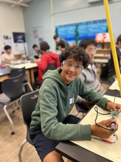

# Ball Tracking Robot
<!---Replace this text with a brief description (2-3 sentences) of your project. This description should draw the reader in and make them interested in what you've built. You can include what the biggest challenges, takeaways, and triumphs from completing the project were. As you complete your portfolio, remember your audience is less familiar than you are with all that your project entails!-->

<!---You should comment out all portions of your portfolio that you have not completed yet, as well as any instructions:-->

| **Engineer** | **School** | **Area of Interest** | **Grade** |
|:--:|:--:|:--:|:--:|
| Arman V | Lynbrook High School | Mechanical Engineering | Incoming Sophmore


  
# Final Milestone

<!---**Don't forget to replace the text below with the embedding for your milestone video. Go to Youtube, click Share -> Embed, and copy and paste the code to replace what's below.**-->

<iframe width="560" height="315" src="https://www.youtube.com/embed/F7M7imOVGug" title="YouTube video player" frameborder="0" allow="accelerometer; autoplay; clipboard-write; encrypted-media; gyroscope; picture-in-picture; web-share" allowfullscreen></iframe>

For your final milestone, explain the outcome of your project. Key details to include are:
- What you've accomplished since your previous milestone
- What your biggest challenges and triumphs were at BSE
- A summary of key topics you learned about
- What you hope to learn in the future after everything you've learned at BSE


# Second Milestone

<!---**Don't forget to replace the text below with the embedding for your milestone video. Go to Youtube, click Share -> Embed, and copy and paste the code to replace what's below.**-->

<iframe width="560" height="315" src="https://www.youtube.com/embed/y3VAmNlER5Y" title="YouTube video player" frameborder="0" allow="accelerometer; autoplay; clipboard-write; encrypted-media; gyroscope; picture-in-picture; web-share" allowfullscreen></iframe>

For your second milestone, explain what you've worked on since your previous milestone. You can highlight:
- Technical details of what you've accomplished and how they contribute to the final goal
- What has been surprising about the project so far
- Previous challenges you faced that you overcame
- What needs to be completed before your final milestone 

# First Milestone

<!---**Don't forget to replace the text below with the embedding for your milestone video. Go to Youtube, click Share -> Embed, and copy and paste the code to replace what's below.**-->

<iframe width="560" height="315" src="https://www.youtube.com/embed/CaCazFBhYKs" title="YouTube video player" frameborder="0" allow="accelerometer; autoplay; clipboard-write; encrypted-media; gyroscope; picture-in-picture; web-share" allowfullscreen></iframe>

For your first milestone, describe what your project is and how you plan to build it. You can include:
- An explanation about the different components of your project and how they will all integrate together
- Technical progress you've made so far
- Challenges you're facing and solving in your future milestones
- What your plan is to complete your project

# Arduino Starter Kit Project

<!---**Don't forget to replace the text below with the embedding for your milestone video. Go to Youtube, click Share -> Embed, and copy and paste the code to replace what's below.**-->

<iframe width="560" height="315" src="https://www.youtube.com/embed/CaCazFBhYKs" title="YouTube video player" frameborder="0" allow="accelerometer; autoplay; clipboard-write; encrypted-media; gyroscope; picture-in-picture; web-share" allowfullscreen></iframe>

For my starter project I chose the Arduino Starter Kit as it is teaches the basics of Java coding and circuitry and could be the basis for many mechanical engineering projects I choose to pursue in the future. I used the Arduino to build a simple circuit, that with the press of a button can turn on and off 2 seprate LED lights. When the button is pressed or read as HIGH the blue LED is set to LOW, or off, and the green LED is set to HIGH, or turns on, and vice versa when the button is read as LOW, or is not being pressed. I created this circuit using an Arduino, a proto shield, a handful of hook up wires, 3 resistors, a button, and a bread board for testing. 

### Challenges

Most of my challenges came in my inexperience with an Arduino and its accessories. It took me sometime to learn how all the inputs and outputs work: motors, servos, LEDs, motion sensers, buttons, and switches. My first challenge came in choosing to use the motion sensor. I had wired everything correctly, but the sensor would pick up everything in such a large radius that the LED was getting to many signals at once. I had then changed to the button, but I faced an obstacle where one of the LEDs where not turning on. I then realized that two components - the button and the red LED - were on the same row of the breadboard causing a short, and when I fixed that the circuit was finally ready to move to the proto shield. My final challenge was moving the entire circuit. I did not have a lot of soldering experience and soldering so many small components caused me to melt many wire coverings and solder into unnecessary holes. The circuit was finiky and sometimes would not work, but I used a little more solder, made sure the connections between the wires were secure, and tested connections with hook up wires to finally get to the end result. 

### Takeaways

My main takeaways from this project were in building circuits and Java programming, two very important skills for future projects. I learned how to build and test cuircuits on an Arduino with hook up wires and a breadboard, solder components to a protoshield and troubleshoot programming and wiring issues. I also learned how intiate inputs and outputs in Java basic if and else statements and while loops(both things I had learned before).

# Schematics 
Here's where you'll put images of your schematics. [Tinkercad](https://www.tinkercad.com/blog/official-guide-to-tinkercad-circuits) and [Fritzing](https://fritzing.org/learning/) are both great resoruces to create professional schematic diagrams, though BSE recommends Tinkercad becuase it can be done easily and for free in the browser. 

# Code
Here's where you'll put your code. The syntax below places it into a block of code. Follow the guide [here]([url](https://www.markdownguide.org/extended-syntax/)) to learn how to customize it to your project needs. 

### Starter Project Code

```/*
  Button

  Turns on and off 2 LEDs connected to digital pin 13 and 12,
  when pressing a pushbutton attached to pin 2.

*/

// constants won't change. They're used here to set pin numbers:
const int buttonPin = 2;  // the number of the pushbutton pin
const int led13 = 13;    // the number of LED pin
const int led12 = 12; // the number of the LED pin 2
// variables will change:
int buttonState = 0;  // variable for reading the pushbutton status

void setup() {
  // initialize the LED pin as an output:
  pinMode(led13, OUTPUT);
  pinMode(led12, OUTPUT);
  // initialize the pushbutton pin as an input:
  pinMode(buttonPin, INPUT);
  Serial.begin(9600);
}

void loop() {
  // read the state of the pushbutton value:
  buttonState = digitalRead(buttonPin);

  // check if the pushbutton is pressed. If it is, the buttonState is HIGH:
  if (buttonState == HIGH) {
    // turn LED on:
    digitalWrite(led13, LOW);
    digitalWrite(led12, HIGH);
    Serial.println("On");
  } else {
    // turn LED off:
    digitalWrite(led13, HIGH);
    digitalWrite(led12, LOW);
  }
}
```

# Bill of Materials
Here's where you'll list the parts in your project. To add more rows, just copy and paste the example rows below.
Don't forget to place the link of where to buy each component inside the quotation marks in the corresponding row after href =. Follow the guide [here]([url](https://www.markdownguide.org/extended-syntax/)) to learn how to customize this to your project needs. 

| **Part** | **Note** | **Price** | **Link** |
|:--:|:--:|:--:|:--:|
| Item Name | What the item is used for | $Price | <a href="https://www.amazon.com/Arduino-A000066-ARDUINO-UNO-R3/dp/B008GRTSV6/"> Link </a> |
| Item Name | What the item is used for | $Price | <a href="https://www.amazon.com/Arduino-A000066-ARDUINO-UNO-R3/dp/B008GRTSV6/"> Link </a> |
| Item Name | What the item is used for | $Price | <a href="https://www.amazon.com/Arduino-A000066-ARDUINO-UNO-R3/dp/B008GRTSV6/"> Link </a> |

# Other Resources/Examples
One of the best parts about Github is that you can view how other people set up their own work. Here are some past BSE portfolios that are awesome examples. You can view how they set up their portfolio, and you can view their index.md files to understand how they implemented different portfolio components.
- [Example 1](https://trashytuber.github.io/YimingJiaBlueStamp/)
- [Example 2](https://sviatil0.github.io/Sviatoslav_BSE/)
- [Example 3](https://arneshkumar.github.io/arneshbluestamp/)

To watch the BSE tutorial on how to create a portfolio, click here.
